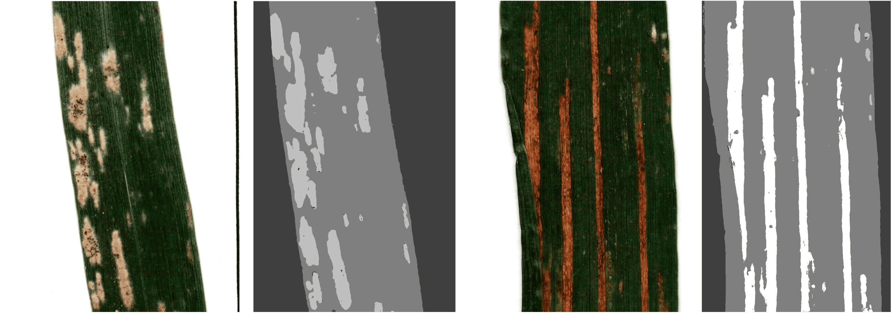

<!---------------------------------------------->
<a name="readme-top"></a>
<!---------------------------------------------->
<h1 align="center">
  <br>
  SegLeaf
  <br>
</h1>



<h4 align="center">A tool to split leaf images and segment diseases</h4>

<!---------------------------------------------->

<p align="center">
  
  <a href="LICENSE">
  
  </a>
  <a href="https://github.com/psf/black">
  
  </a>
</p>

<!---------------------------------------------->

## 🌄 Overview

This project is a Python tool designed to assist with the segmentation and splitting of leaf images, with a particular focus on identifying and analyzing plant diseases. It provides an intuitive graphical interface for users to split leaves and segment diseased areas. The application is suitable for researchers, agronomists, and anyone working in plant pathology or phenotyping, offering both command-line and GUI modes for flexible workflows. 🌱🦠

<!---------------------------------------------->

## 📦 Getting Started

### Prerequisites

Before you begin, make sure you have the following:

1. **Ilastik Software**  
  Download and install Ilastik for your operating system from the [official website](https://www.ilastik.org/download). Ilastik is required to train or use segmentation models with this tool.

2. **Trained Model (.ilp)**  
  - You can download a pre-trained model from this [Google Drive folder](https://drive.google.com/drive/folders/1onnnMpm90fbD1AaYEKAe_gVkTO8Fz5mB?usp=sharing). Four models are available, each corresponding to a different color space. For most cases, it is recommended to use the **LAB.ilp** model for optimal performance.
  - **Or train your own model:** If you want a model tailored to your dataset, follow our step-by-step guide in the [Ilastik training documentation](docs/ilastik_training.md). This allows you to adapt the segmentation to your own images and classes.


### Installation

1. Clone the repository:

```bash
git clone https://github.com/titouanlegourrierec/project.git
cd project
```

2. Create a Python virtual environment:

```bash
python -m venv venv
```

3. Activate the virtual environment:
  * On Windows:
  ```bash
  venv\Scripts\activate
  ```
  * On macOS & Linux:
  ```bash
  source venv/bin/activate
  ```

4. Install the dependencies:
```bash
pip install -r requirements.txt
```

<!---------------------------------------------->


## 🛠️ Usage

You can use this project in two ways:

1. **Graphical User Interface (GUI):**
```bash
python -m src.app
```

2. **Command Line Interface (CLI):**

Before using the CLI, specify your scanner's resolution (DPI) in the [configuration file](src/config.py). You must also provide the color for each class in the [color_map file](src/color_map.json).

> [!NOTE]
> It is recommended to fill the `color_map` file in the following order: first the background color, then the leaf color, and finally the colors corresponding to the different diseases. This ensures optimal processing during segmentation.

- To split leaves in images into individual images (with optional color space):

```bash
python -m src.cli split path/to/input_dir path/to/output_dir --color_space LAB
```

- To segment leaves in images using a trained model:

```bash
python -m src.cli segment path/to/model.ilp path/to/input_dir path/to/output_dir
```

<!---------------------------------------------->

## ⚖️ License

This project is licensed under the [**GNU GPLv3 License**](LICENSE). You are free to use, modify, and distribute this software under the terms of the GPLv3. However, the software is provided “as is”, without warranty of any kind.

<!---------------------------------------------->
<p align="right"><a href="#readme-top">back to top</a></p>
<!---------------------------------------------->


---

> GitHub [@titouanlegourrierec](https://github.com/titouanlegourrierec) &nbsp;&middot;&nbsp;
> Email [titouanlegourrierec@icloud.com](mailto:titouanlegourrierec@icloud.com)
