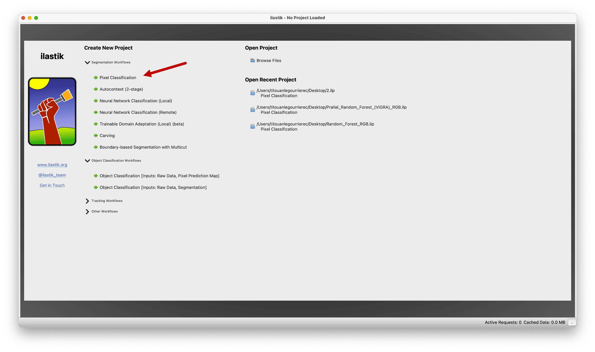

# Ilastik Training

To download Ilastik, visit the [Ilastik website](https://www.ilastik.org/download) and follow the installation instructions for your operating system.

## Table of Contents
- [How to Use Ilastik?](#how-to-use-ilastik)
- [1. Loading Images for Model Training](#1-loading-images-for-model-training)
- [2. Feature Selection](#2-feature-selection)
- [3. Annotating Images](#3-annotating-images)
- [4. Refining the Model with Incremental Learning](#4-refining-the-model-with-incremental-learning)
- [5. Exporting Predictions and Saving the Model](#5-exporting-predictions-and-saving-the-model)

## How to Use Ilastik?

Once Ilastik is installed, launch the software and select **"Pixel Classification"** under the **Segmentation Workflows** section to get started.

### 1. Loading Images for Model Training

To begin, add the images needed for training the model :

- Click on the **Add New** button.
- Select **Add separate images** to upload your image files.

### 2. Feature Selection

Click on the **2. Feature Selection** button in the left-hand menu. A popup will appear with a set of feature checkboxes.

- **Select all the boxes**. These features represent different image properties like edges, textures, and intensity patterns. Ilastik will automatically determine which ones are most relevant based on your images.
- Click **OK**, then proceed to **3. Training**.

### 3. Annotating Images

Now comes the interactive part :

- Add the labels you need for each class in your dataset.
- Use the pen tool to annotate regions on your images, assigning them to the appropriate labels.

### 4. Refining the Model with Incremental Learning

Once you have made your initial annotations, click on the **Suggest Features** button. This allows Ilastik to select the most relevant features for your specific dataset.

You can incrementally improve the model’s predictions :

- Review the segmentation results produced by your model.
- Annotate more areas or correct any inaccuracies to refine the predictions further.

This iterative approach ensures that your model adapts to the complexity of your data.

### 5. Exporting Predictions and Saving the Model

Once you are satisfied with the results :

1. Click on **4. Prediction Export** in the left menu.
2. Open **Choose Export Image Settings** and adjust the **Renormalize [min, max]** parameter to reflect the number of classes in your dataset (e.g. 0 to the number of labels you created).
3. Save the model as an **.ilp** file for future use.

---

You have successfully trained and exported a model using Ilastik. You can now use your model for predictions with our tool.
