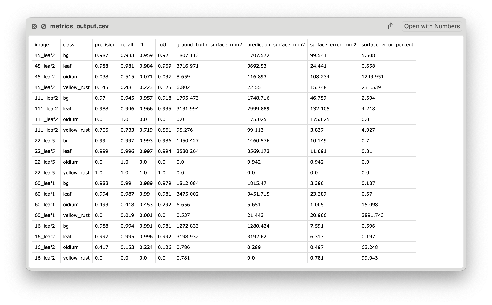

# Model Evaluation Guide

This guide will help you evaluate your model's performance step by step.

## 1. Prepare Test Images

Place all test images to be evaluated in the `evaluation/images_to_segment` directory.

## 2. Create Ground Truth Annotations

### Annotate Images

Use the [VGG Image Annotator (VIA)](https://www.robots.ox.ac.uk/~vgg/software/via/via_demo.html) to annotate your test images. For detailed instructions, see the [VIA tutorial](VIA_tutorial.md).

After annotating, export your annotations as a JSON file named `ground_truth.json` and place it in the `evaluation` directory.

### Generate Ground Truth Masks

With `ground_truth.json` in place, generate ground truth masks by running:

```bash
python -m evaluation.src.generate_groundtruth --background_color <background_color>
```

> [!NOTE]
> Replace `<background_color>` with the appropriate value for your dataset. For a full list of options, run:
> ```bash
> python -m evaluation.src.generate_groundtruth --help
> ```

## 3. Generate Model Predictions

Run your model to generate predictions for the test images:

```bash
python -m evaluation.src.segment_leaves --model_path <path_to_your_model>
```

> [!NOTE]
> Replace `<path_to_your_model>` with the path to your trained model. For more options, see:
> ```bash
> python -m evaluation.src.segment_leaves --help
> ```

## 4. Evaluate Model Performance

Calculate evaluation metrics by running:

```bash
python -m evaluation.src.generate_metrics --dpi <dpi>
```

> [!NOTE]
> Replace `<dpi>` with your scanner's DPI value. For additional parameters, run:
> ```bash
> python -m evaluation.src.evaluate_model --help
> ```

Below is an example of the CSV output:


