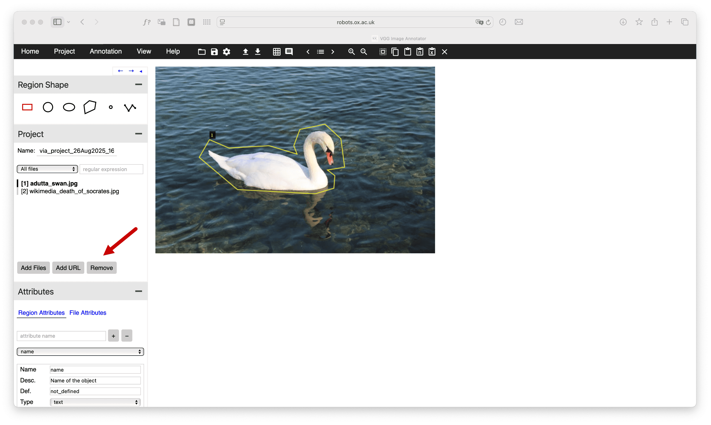
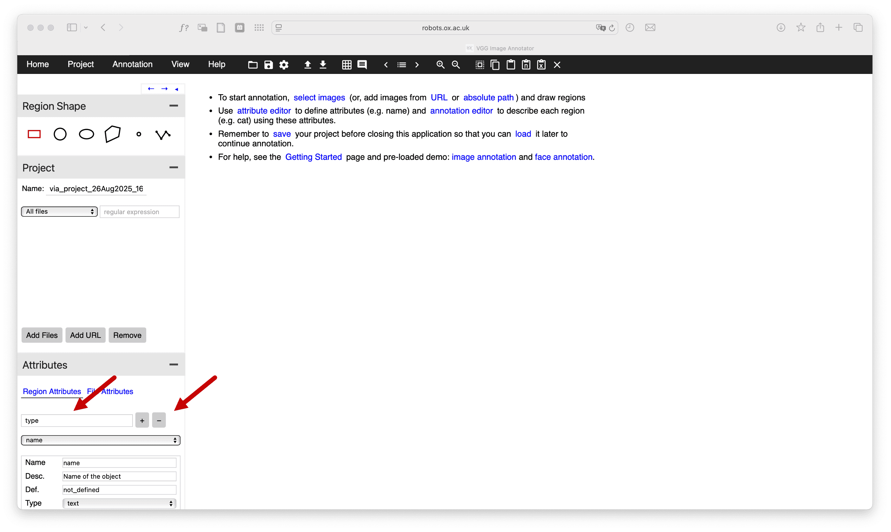
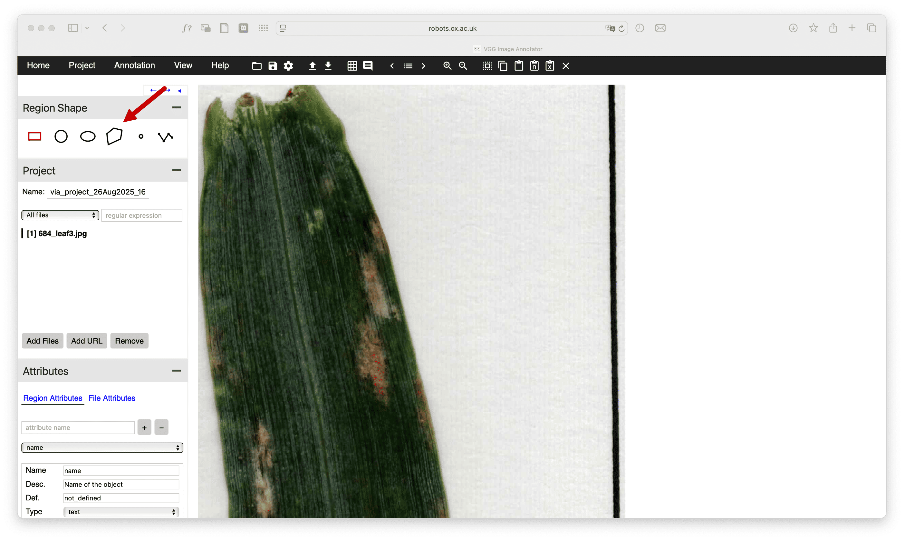
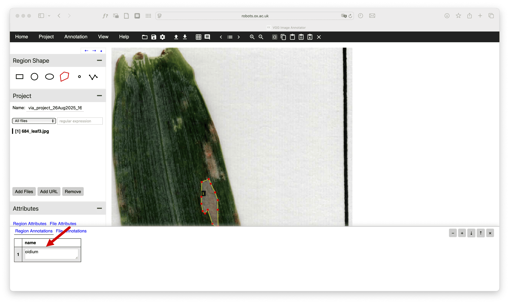
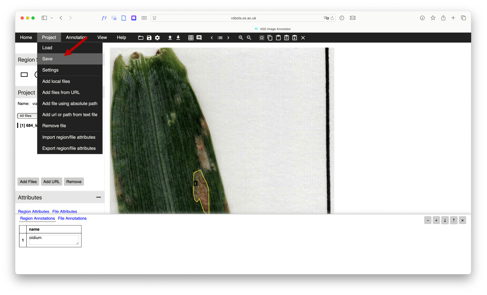

# Test Set Annotation Guide

Use the [VGG Image Annotator (VIA)](https://www.robots.ox.ac.uk/~vgg/software/via/via_demo.html) to annotate your test images.

## 1. Remove example images

Before starting the annotation, delete any example images that may be present. This ensures you are only working with your own images.

## 2. Remove irrelevant attributes

While annotating, remove any attributes that are not relevant to your task. For example, you can delete the `type` and `image_quality` attributes.

## 3. Annotate images with regions

You can now start annotating your images by adding regions using the VIA tool.

## 4. Rename regions

After adding the regions, rename each one with the name of the corresponding class (for example: background, leaf, or the name of the disease).

> [!IMPORTANT]
> The name of each region must exactly match one of the class names defined in the [`color_map.json`](../src/color_map.json) file.

## 5. Export annotations as JSON

Once annotation and renaming are complete, export the annotations as a JSON file. This file will be used for evaluation.

That's it! You have annotated your images with VIA. Rename the exported JSON file to `ground_truth.json` and place it in this folder.